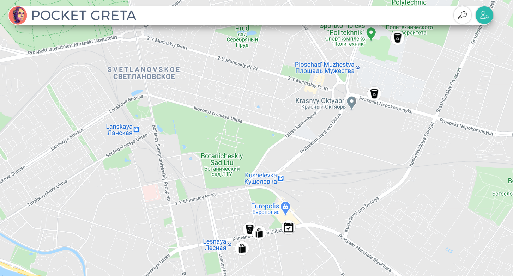
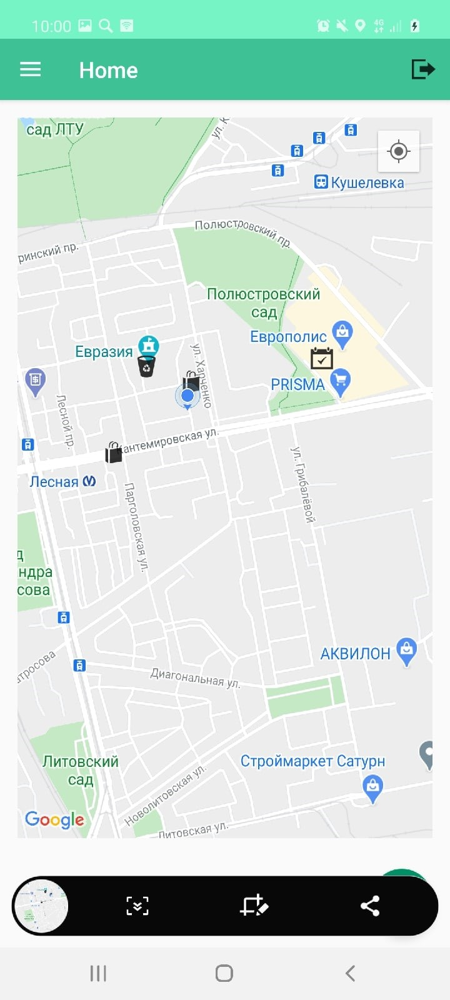
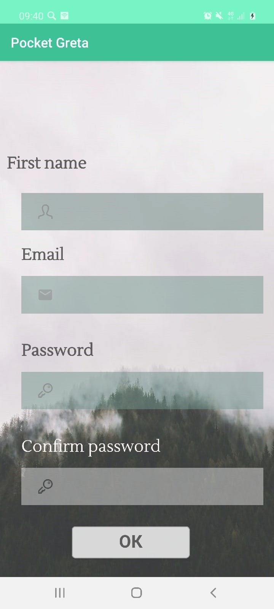
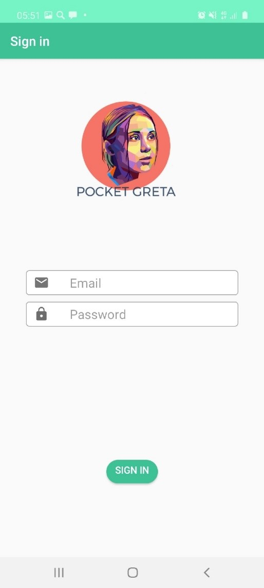
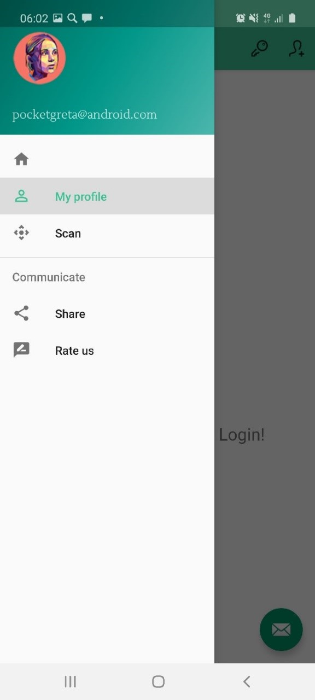
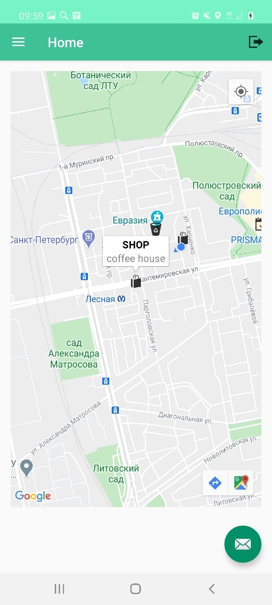
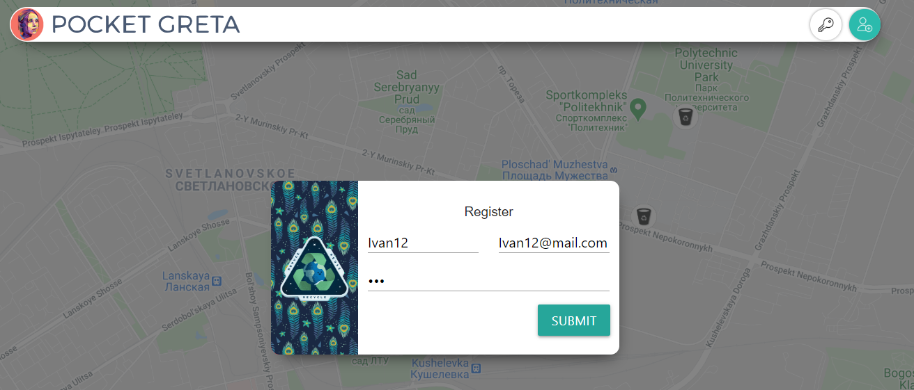
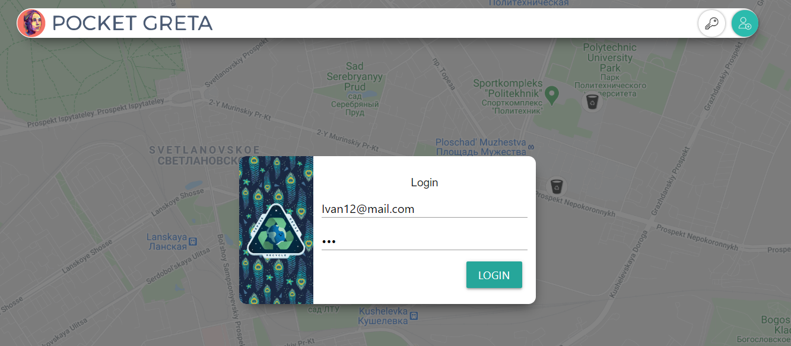
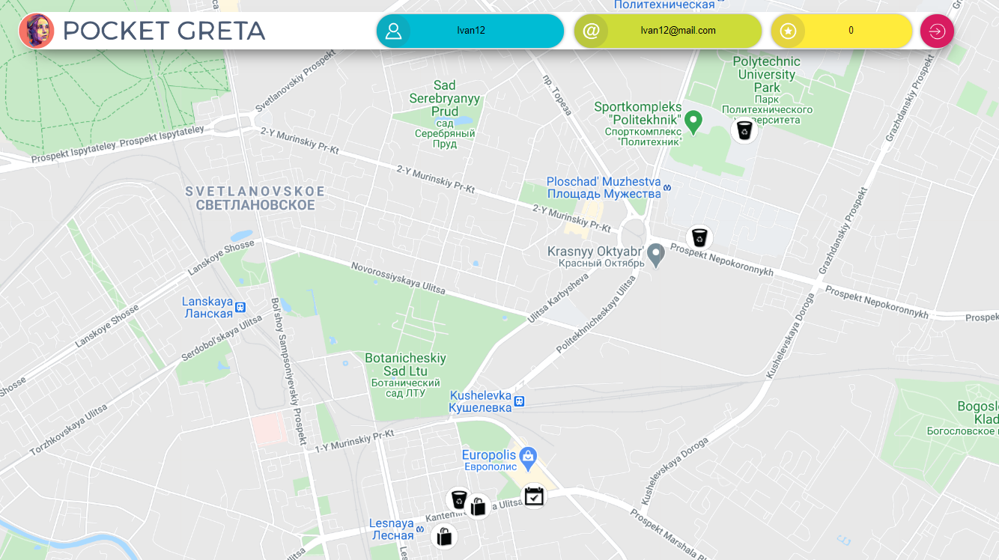
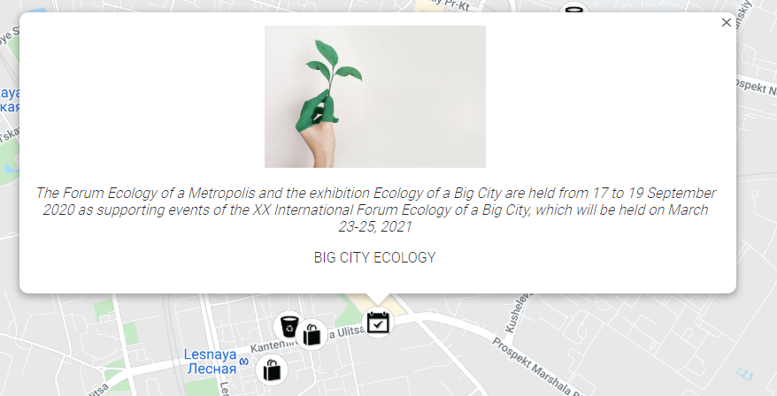

# PocketGreta

## Description
Currently, on the territory of St. Petersburg there are cafes and shops that provide discounts to customers when using their containers. Also, there are separate waste collection points and organizations interested in using secondary raw materials. In addition, events are being held to educate the public about responsible consumption and environmental issues.
The main task of the proposed concept of the application is the aggregation of the above organizations, points and events in order to provide information about them to interested parties. In addition, the concept offers a unified system of bonuses to encourage and motivate users. The working title "Pocket Greta" was chosen for the project.

### Built with

* [Postman](https://www.postman.com/)
* [Spring Boot](https://spring.io/projects/spring-boot)
* [Spring MVC](https://docs.spring.io/spring-framework/docs/current/spring-framework-reference/web.html)
* [Spring Security](https://spring.io/projects/spring-security)
* [Spring Data JPA](https://spring.io/projects/spring-data)
* [Lombok](https://projectlombok.org/)
* [JsonWebToken](https://jwt.io/)
* [PostgreSQL](https://www.postgresql.org/)
* [Axios](https://github.com/axios/axios)
* [Google Maps API](https://developers.google.com/maps/documentation)
* [Materialize](https://materializecss.com/)
* [ngrok](https://ngrok.com/)
* [Flask](https://flask.palletsprojects.com/en/1.1.x/)

### Installation
#### Android
1. Clone repository using Git.
2. Go to PocketGreta\Android\AppPocketGreta\app\build\outputs\apk.
3. Download apk on your device and run.
##### OR
1. Clone repository using Git.
2. Open project in Android Studio.
3. Built project.
4. Run on emulator or real device.

#### Web
1. Install Docker.
2. Clone repository using Git.
3. Copy sertificate and private key in Web/server/certs
4. Run: docker build -t greta_web ./Web
5. Run: docker run -p 443:443 greta_web > log.txt & disown

#### Backend 
To build the server side, you need to generate a JKS file, copy it to the resources folder. \
Rename application.properties.local to application.properties and insert your values where written in this file.\
You can use ngrok to access the external network

### Usage
#### Android
 Firstly, you must register by pressing the button on the top right angle. Then you see the info of all separate waste collection points by pressing on any icon on the map.
 Also, you can scan QR-code that was given you by organization interested in using secondary raw materials and get points for your contribution to the environment. The number of earned points you can see in your profile where you can get by side menu. 
 
 
 
 
 
 #### Web
 Firstly, you must register by pressing the button on the top right angle. Then you see the info of all separate waste collection points by pressing on any icon on the map.
 Also, you the number of pointed you earned by scanning QR-codes that was given you by organizations interested in using secondary raw materials on the top pannel. 
 
 
 
 
